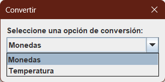
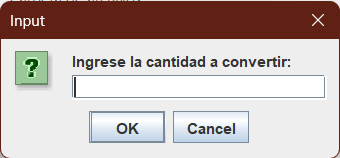
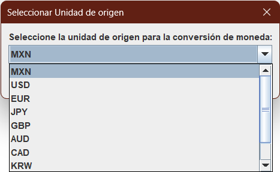
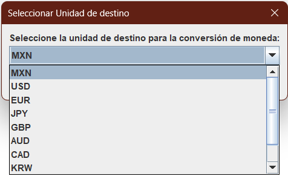
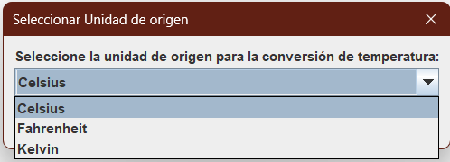
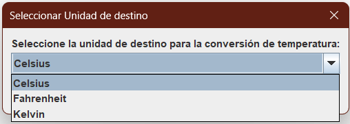
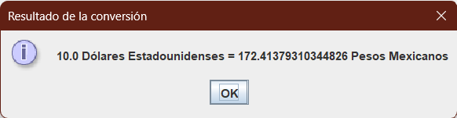
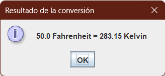
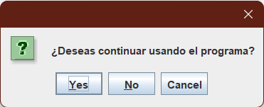
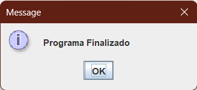

# Proyecto Conversor - Challenge Alura Backend

Este proyecto es parte del Challenge ONE Back End - Java Sprint 01: Crea tu propio conversor de moneda.

Es un conversor de monedas y temperaturas utilizando como interfaz gráfica java swing.

## Características

- Permite convertir entre las siguientes monedas:
    - Peso mexicano (MXN)
    - Dólar estadounidense (USD)
    - Euro (EUR)
    - Libra esterlina (GBP)
    - Yen japonés (JPY)
    - Yuan chino (CNY)
    - Dólar australiano (AUD)
    - Dólar canadiense (CAD)
    - Won surcoreano (KRW)
    - Dólar de Hong Kong (HKD)
- Permitir convertir entre las siguientes temperaturas:
    - Celsius (°C)
    - Fahrenheit (°F)
    - Kelvin (K)
- Ejecución continua hasta que el usuario decida salir.
- Interfaz gráfica intuitiva y fácil de usar.

## Capturas de pantalla

## Interfaz inicial
<table>
    <tr>
        <td></td>
        <td></td>
    </tr>
</table>

## Selección origen y destino moneda
<table>
    <tr>
        <td></td>
        <td></td>
    </tr>
<table>

## Selección origen y destino temperatura
<table>
    <tr>
        <td></td>
        <td></td>
    </tr>
<table>

## Output
<table>
    <tr>
        <td></td>
        <td></td>
    </tr>
<table>

## Opciones continuar
<table>
    <tr>
        <td></td>
        <td></td>
    </tr>
<table>

## Uso

1. Selecciona el tipo de conversión que deseas realizar desde la lista desplegable.
2. Ingresa el valor que deseas convertir en el campo de texto.
3. Selecciona la moneda o temperatura de origen.
4. Selecciona la moneda o temperatura de destino.
5. El resultado de la conversión se mostrará en una ventana emergente.
6. Selecciona si deseas continuar con el programa.


## Tecnologías utilizadas

- Java 17
- Java Swing

## Factores de conversión

### Moneda

| Moneda | Factor de conversión |
|--------|----------------------|
| USD    | 0.058                |
| EUR    | 0.049                |
| PY     | 6.35                 |
| GBP    | 0.042                |
| AUD    | 0.079                |
| CAD    | 0.073                |
| KRW    | 66.64                |
| CNY    | 0.37                 |
| HKD    | 0.45                 |

> **Nota:** El factor de conversión es respecto al peso mexicano (MXN).
### Temperatura

| Temperatura origen | Temperatura destino | Formula de conversión |
|--------------------|---------------------|-----------------------|
| Celsius (°C)       | Fahrenheit (°F)      | (°C * 9/5) + 32       |
| Celsius (°C)       | Kelvin (K)          | °C + 273.15           |
| Fahrenheit (°F)    | Celsius (°C)        | (°F - 32) * 5/9       |
| Fahrenheit (°F)    | Kelvin (K)          | (°F + 459.67) * 5/9   |
| Kelvin (K)         | Celsius (°C)        | K - 273.15            |
| Kelvin (K)         | Fahrenheit (°F)     | (K * 9/5) - 459.67    |


## Ejecución

El archivo jar ejecutable se encuentra en la raíz del proyecto. Para ejecutarlo, abre una terminal en la raíz del proyecto y ejecuta el siguiente comando:

```bash
java -jar conversor.jar
```

> **Nota:** Es necesario tener instalado Java 17 o superior.

## Contribución

Este proyecto forma parte del Challenge ONE Back End - Java Sprint 01: Crea tu propio conversor de moneda. Aunque está diseñado como un ejercicio de aprendizaje, las contribuciones son bienvenidas. Si encuentras algún error, tienes alguna idea de mejora o deseas agregar nuevas funcionalidades, siéntete libre de hacerlo. ¡Tu participación es valorada!

Si tienes alguna duda relacionada con el proyecto o el Challenge ONE, también puedes compartirla. Estaré encantado de ayudarte.

## Autor

- [Raymundo Silvestre Gonzalez Contreras](https://github.com/RaymundoSGlz)

## Licencia

Este proyecto está bajo la [Licencia MIT](LICENSE).